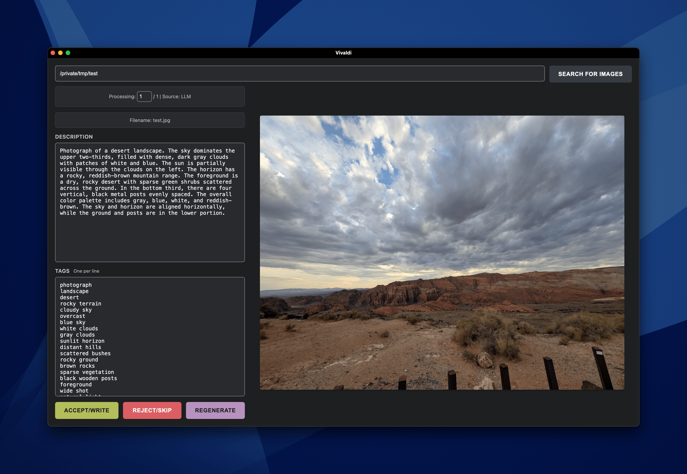

# Imagecaption



A Phoenix LiveView application for batch processing JPEG images with AI-generated descriptions and keywords. The application provides a web interface for reviewing, editing, and writing EXIF metadata to image files.

## Architecture

This application implements a workflow for processing collections of JPEG images:

1. Directory scanning using `fd` to locate JPEG files
2. EXIF metadata extraction via `exiftool`
3. AI-powered caption generation using a local llama.cpp server
4. Interactive review and editing interface
5. EXIF metadata writing back to image files

The system prioritizes existing EXIF data over LLM generation. If an image contains both Description and Keywords EXIF fields, those values are presented for review. Otherwise, the application queries a local LLM to generate descriptions and tags.

## Prerequisites

### Required System Dependencies

- Elixir 1.15 or later
- Erlang/OTP 26 or later
- `exiftool` - EXIF metadata manipulation
- `fd` - Fast file discovery utility
- An AI model with vision compatibility and an OpenAI-compatible API (e.g., llama.cpp with vision model)

### Local LLM Server Setup

The application can be somewhat token hungry, and I recommend you use a local server, so as to not have blossoming costs from API usage. You can set up a local llama.cpp server with vision capabilities by following these general steps:

1. Install `llama.cpp`. Instructions in [its github repository](https://github.com/ggml-org/llama.cpp)
2. Run the following command to pull a vision-capable model and start the captioning server
```
  llama-server -hf concedo/llama-joycaption-beta-one-hf-llava-mmproj-gguf:Q6_K_L -c 8192 --port 8088
```
3. Set the following environment variables when starting the Phoenix server, if you deviated from the defaults:
   - `LLM_BASE_URL` - Base URL of llama.cpp server (default: `http://localhost:8088`)
   - `LLM_MODEL` - Model identifier (default: `Llama-Joycaption-Beta-One-Hf-Llava-Q4_K`)


## Installation

```sh
# Clone and navigate to project directory
cd imagecaption

# Check for required system dependencies
mix check_deps

# Install dependencies
mix setup

# Start the Phoenix server
mix phx.server
```

The application will be available at `http://localhost:4000`.

### Checking System Dependencies

The `mix check_deps` task verifies that required system tools are installed:

```sh
mix check_deps
```

This will check for `fd` and `exiftool` and report their versions. If any dependencies are missing, the task will provide installation instructions and exit with a non-zero status code.

## Configuration

### LLM Configuration

LLM parameters are configured via environment variables:

- `LLM_BASE_URL` - Base URL of llama.cpp server (default: `http://localhost:8088`)
- `LLM_MODEL` - Model identifier (default: `Llama-Joycaption-Beta-One-Hf-Llava-Q4_K`)
- `LLM_MAX_TOKENS` - Maximum token count for responses (default: `300`)
- `LLM_TEMPERATURE` - Sampling temperature (default: `0.7`)
- `LLM_DESCRIPTION_PROMPT` - System prompt for description generation
- `LLM_TAGS_PROMPT` - System prompt for tag generation

Configuration is loaded from `config/runtime.exs`.


## License

```
MIT License

Copyright (c) 2025 Jeff Sandberg

Permission is hereby granted, free of charge, to any person obtaining a copy
of this software and associated documentation files (the "Software"), to deal
in the Software without restriction, including without limitation the rights
to use, copy, modify, merge, publish, distribute, sublicense, and/or sell
copies of the Software, and to permit persons to whom the Software is furnished
to do so, subject to the following conditions:

The above copyright notice and this permission notice (including the next
paragraph) shall be included in all copies or substantial portions of the
Software.

THE SOFTWARE IS PROVIDED "AS IS", WITHOUT WARRANTY OF ANY KIND, EXPRESS OR
IMPLIED, INCLUDING BUT NOT LIMITED TO THE WARRANTIES OF MERCHANTABILITY, FITNESS
FOR A PARTICULAR PURPOSE AND NONINFRINGEMENT. IN NO EVENT SHALL THE AUTHORS
OR COPYRIGHT HOLDERS BE LIABLE FOR ANY CLAIM, DAMAGES OR OTHER LIABILITY,
WHETHER IN AN ACTION OF CONTRACT, TORT OR OTHERWISE, ARISING FROM, OUT OF
OR IN CONNECTION WITH THE SOFTWARE OR THE USE OR OTHER DEALINGS IN THE SOFTWARE.
```
